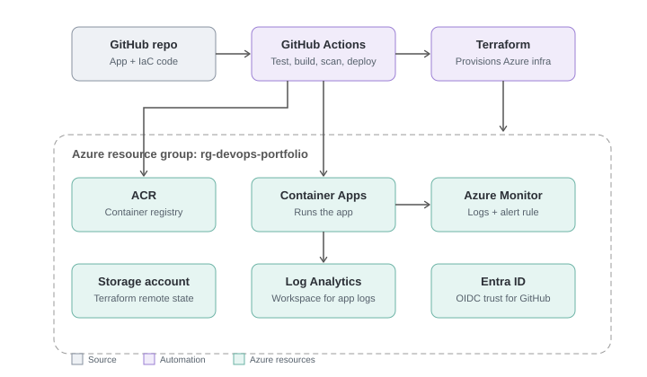

# DevOps Portfolio Project

A small Flask application deployed to Azure using a fully automated, Infrastructure-as-Code pipeline — built to demonstrate core DevOps practices end to end.

**Repo:** https://github.com/mukeshr1197/devops-portfolio

---

## Architecture



Terraform provisions all of the above, with remote state in an Azure Storage account.
Azure Entra ID (OIDC) lets GitHub Actions authenticate to Azure with no stored passwords.
```

A push to `main` triggers the pipeline: tests run, the image is built and scanned for vulnerabilities (Trivy), pushed to Azure Container Registry, and deployed to Azure Container Apps. Azure Monitor watches the app's logs and alerts by email if errors appear.

## Tech stack

| Layer | Tool |
|---|---|
| App | Python (Flask) |
| Containerization | Docker |
| Infrastructure as Code | Terraform |
| Cloud | Microsoft Azure (Container Apps, ACR, Log Analytics, Monitor) |
| CI/CD | GitHub Actions |
| Authentication | Entra ID federated credentials (OIDC — no stored secrets) |
| Security scanning | Trivy |

## What it does

The app itself is intentionally minimal — a `/` endpoint and a `/health` endpoint — because the point of this project is the pipeline and infrastructure around it, not the application logic. Everything from the Dockerfile to the Azure resources to the deployment process is defined as code and fully reproducible.

## Key decisions and trade-offs

- **OIDC over stored secrets:** GitHub Actions authenticates to Azure using a federated identity credential rather than a stored client secret or password. This removes an entire class of credential-leak risk, at the cost of a more involved one-time setup (Entra ID app registration, federated credential, role assignment).
- **Azure Container Apps over AKS:** Container Apps gives a serverless-style deployment (scales to zero, no cluster to manage) which fits a portfolio project's scale and budget better than running a full Kubernetes cluster. AKS is a natural next step if the project needs orchestration features Container Apps doesn't offer.
- **Commit-SHA image tags:** Each pipeline run builds an image tagged with the Git commit SHA rather than a static tag like `latest`, so every deployment is traceable to an exact commit.
- **Terraform remote state in Azure Storage, kept outside the destroy cycle:** The main infrastructure (`rg-devops-portfolio`) is destroyed between sessions to avoid cost, but the Terraform state storage (`rg-tfstate`) is created once and left alone — otherwise Terraform would lose track of its own state on every teardown.
- **Vulnerability scanning set to non-blocking (for now):** Trivy runs on every build and reports results, but doesn't fail the pipeline yet. This was a deliberate choice to see real scan output before deciding on a severity threshold to enforce.

## How to run it

**Prerequisites:** Git, Docker, Python 3.12+, Azure CLI, Terraform, an Azure subscription.

```bash
# 1. Clone the repo
git clone https://github.com/mukeshr1197/devops-portfolio.git
cd devops-portfolio

# 2. Run the app locally
cd app
python -m venv .venv
.venv\Scripts\Activate.ps1   # Windows
pip install -r requirements.txt
pytest
docker build -t devops-app:v1 .
docker run -p 8080:8080 devops-app:v1
# visit http://localhost:8080

# 3. Provision the Azure infrastructure
cd ../terraform
az login
terraform init
terraform apply

# 4. Push an image so the Container App has something to run
az acr login --name <your-acr-name>
docker build -t <your-acr-name>.azurecr.io/devops-app:v1 ../app
docker push <your-acr-name>.azurecr.io/devops-app:v1
terraform apply   # picks up the new image

# 5. Get the live URL
terraform output container_app_url
```

From here, any push to `main` on GitHub automatically tests, builds, scans, and redeploys the app via the GitHub Actions workflow in `.github/workflows/deploy.yml`.

**To tear everything down** (and avoid ongoing cost):
```bash
cd terraform
terraform destroy
```

## Challenges and what I learned

- **OIDC subject mismatch:** The federated credential's expected subject (`repo:owner/repo:ref:refs/heads/main`) didn't match what GitHub actually sent, which included numeric suffixes (`repo:owner@id/repo@id:ref:...`). Diagnosed via the `AADSTS700213` error in the Actions log, fixed by recreating the federated credential with the exact subject GitHub was presenting.
- **Terraform state drift after a destroy/apply cycle:** After destroying and recreating the environment, the Container App ended up existing in Azure but missing from Terraform's state, then stuck in a failed provisioning state after an image-not-found error. Resolved by diagnosing with `terraform state list`, attempting `terraform import`, and when that failed against the broken resource, deleting it directly with `az containerapp delete` and letting Terraform recreate it cleanly.
- **Chicken-and-egg deployment ordering:** On a fresh Azure Container Registry, the Container App can't be created until an image actually exists in the registry — so the very first deploy after any full teardown needs one manual `docker push` before `terraform apply` will succeed.

## Possible extensions

- Deploy to Azure Kubernetes Service (AKS) and compare the operational experience with Container Apps
- Enforce the Trivy scan as a blocking gate above a chosen severity threshold
- Add a staging environment and promote images through environments rather than deploying straight to production on every push

---

Built as a self-directed portfolio project to close a hands-on gap between prior AWS/GitHub Actions experience and broader DevOps practice on Azure.
